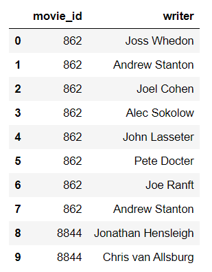

# ETL_netflix_movie_db
This is a mock project built for practicing ETL processes.

<p align="center">
  
</p>

## Background
While there is a lot of information available on starring actors and movie directors and producers, not a lot of spotlight is offered to the people working behind the scenes, such as stuntpersons, writers, sound technicians etc. 

In this _fictional_ project, the [Writer's Guild of America (WGA)](https://www.wga.org/) wants to analyze the number and frequency of similar writers who have worked on different movies all around the globe. Our group was tasked with the ETL phase of the project which was to create a relational database of movies revenues, budgets and writers attached to each movie.

## Data Sources
The data was acquired via [Kaggle](https://www.kaggle.com/) in a `.csv` format from the followng links:-

1. `credits.csv` and `movie_metadata.csv` from <https://www.kaggle.com/rounakbanik/the-movies-dataset#movies_metadata.csv>

2. `netflix_titles.csv` from <https://www.kaggle.com/shivamb/netflix-shows>

Further information about the data and its original sources can be found at the corresponding links included above.

## Prerequisites
The project was completed using the following `Python` packages:
```
os
pandas
json
sqlAlchemy
```
`PostgreSQL` was used to create the final database: `ETL_project`.

## Data Clean-up

### 1. Movie metadata
The main movie metadata file `movies_metadata.csv` contains information on approximately 45,000 movies. The following image displays the data is included in the original `.csv` file. 
<p align="center">
  
</p>

For the purpose of this _fictional_ project, only the data regarding **budget, id, original_title, revenue** and **title** was included, as shown below.
<p align="center">
  
</p>

The following process flow was adoptedssssssssssss to clean-up the sliced `movie_metadata_df` before exporting it as a `.csv` to be loaded in `PostgreSQL`.

* Import all columns of raw data file as `str` datatype in Python using `pandas` dataframe.  
* Slice the dataframe to obtain the required columns.
* Convert the **budget** and **revenue** columns to numeric datatype.

While there were no challenges in converting the datatype of **revenue** column to numeric values using `pd.numeric`, the **budget** column had inconsistent datatypes which returned an error. Upon more investigation it was found that three rows did not contain integer values which could be accurately converted to numeric. The decision was made to drop these rows from the original database.
   
In order to locate and drop these rows, [`.str.match('/')`](https://pandas.pydata.org/pandas-docs/stable/reference/api/pandas.Series.str.match.html) function was employed on the **budget** column.

### 2. Movie credits
The original movie credits file had a complex configuration, as shown in the following image.

<p align="center">
  
</p>

The file contains only three columns with information about the cast and crew of movies linked to the metadata table using the `movie_id`. For the purpose of this project, we are only interested in the **crew** data, specifically: data regarding the _Writing_ department. Each row contains data in a huge list of dictionaries which needed to be parsed properly to finally create a dataframe of just the **movie_id** and **writer**. The following function was developed to be executed in a loop which removed `\`, `[` and `]` from a given record and convert the result to a Python dictionary.

<p align="center">
  
</p>

After conversion of each record to a dictionary, it was straightforward to search for all the writers for a given `movie_id` and create a list of dictionaries such as `{movie_id : writer_name}` which was eventually converted into a dataframe and exported as `movie_writers_df.csv`. A snapshot of the final transformed dataframe is shown below.

<p align="center">
  
</p>

### 3. Netflix titles

Downloaded the raw file `netflix_titles.csv` [Kaggle](https://www.kaggle.com/shivamb/netflix-shows) and cleaned it in Excel to remove extraneous columns. Renamed the file `netflix_titles_transformed.csv` and saved it into the _Resources_ folder.

## Entity-Relationship-Diagram
The cleaned data files result in a relational database which are connected as shown by the following ERD.

<p align="center">
  
</p>

## Data Loading to `PostgreSQL`

Created a Jupyter Notebook and read the following cleaned CSV files into a Pandas dataframe, verifying column order and formatting:
* netflix_titles_transformed.csv
* movie_writers_df.csv
* movie_metadata_transformed.csv

Created a `SQL` database named `ETL_project` in pgAdmin4 and wrote a query to create tables for each of the three transformed CSVs. Needed to reformat the `revenue` column in the `metadata` table from `FLOAT` to `NUMERIC(18,1)` due to repeated errors in reading the file.

Joined the `metadata` and `credits` tables on the common `id` and `movie_id` columns, then joined the resulting view with the `titles` table on the common `title` columns.
